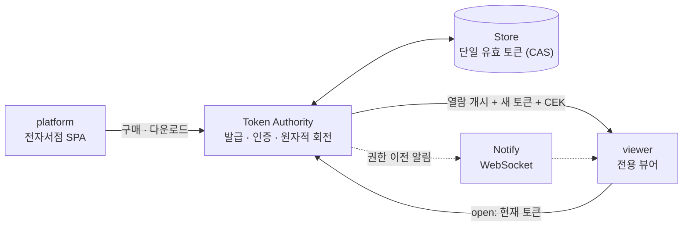

<div align="center">

# 🔐 crypton

### 토큰 회전 기반 디지털 문서 보안

깨질 수 있는 암호가 아니라, **서버가 통제하는 회전 토큰**으로 문서를 보호합니다.<br/>
한 시점에 유효한 토큰은 단 하나 — 무단 재배포가 접근을 *복제*가 아닌 **이전**으로 바꿉니다.

<br/>


[](https://github.com/Grwaywee/crypton/actions/workflows/ci.yml)


[✨ 특징](#-특징) · [🏗️ 아키텍처](#%EF%B8%8F-아키텍처) · [🔄 동작 흐름](#-동작-흐름) · [🚀 빠른 시작](#-빠른-시작) · [🧩 기술 스택](#-기술-스택) · [🛡️ 위협 모델](#%EF%B8%8F-위협-모델) · [🗺️ 로드맵](#%EF%B8%8F-로드맵)

</div>

---

**crypton**은 디지털 문서(PDF 등)를 *암호 강도*가 아니라 *접근 통제*로 보호하는 모노레포입니다. 모든 문서는 **불변 고유값(해시)** 과 **토큰**을 지니며, 열 때마다 보안 서버가 토큰을 인증하고 **새 토큰으로 회전**시킵니다. 유효 토큰이 항상 하나뿐이라, 파일을 공유해도 마지막에 연 기기만 열람할 수 있습니다.

## ✨ 특징

- 🔁 **토큰 회전** — 열람마다 토큰이 바뀌고, 문서당 유효 토큰은 **항상 1개**(원자적 compare-and-swap).
- 🔑 **서버 보관 콘텐츠 키** — 복호화 키(CEK)를 컨테이너에 넣지 않고 서버가 보관, *열람 개시* 때만 전달 → 인증 없이는 복호화 자체가 불가능.
- 🔀 **권한 이전** — 재배포가 접근을 복제하지 않고 이전. 공유받은 사람이 열면 원본 보유자의 토큰이 즉시 무효화.
- 💳 **전자서점 내장** — 결제가 다운로드의 선행조건, 카피(copy) 단위 토큰 계보로 다수 구매자 지원.
- 📴 **오프라인 유예** — 한 번 온라인으로 열면 유효시간 동안 오프라인 열람 가능.
- 🔔 **실시간 알림 + 감사 로그** — 다른 기기에서 열린 사실을 웹소켓으로 통지, 모든 발급/회전/거부를 기록.
- 🔐 **인증·하드닝** — JWT 인증(신원은 본문이 아닌 **검증된 토큰에서 도출**), scrypt 비밀번호 해싱, 보안 헤더(helmet)·CORS·레이트리밋.
- 🧪 **테스트 우선** — 핵심 동작 34개를 `node:test`로 검증, 엔드투엔드 데모 포함.

## 🏗️ 아키텍처



**모노레포 구조**

```
crypton/
├─ packages/
│  ├─ core/       # 공유 계약 — 토큰 모델·서명, AES-256-GCM 컨테이너, API 타입(Zod)
│  ├─ server/     # 보안 서버 — 토큰 권한(발급/인증/원자적 회전), 결제 게이트, 알림, 감사
│  ├─ viewer/     # 전용 뷰어 — 열람 시 토큰 프로토콜, 열람 개시 후에만 렌더, 오프라인 유예
│  └─ platform/   # 전자서점 — 마켓플레이스 SPA + 보안서버 포워딩 + 브라우저 웹 뷰어
├─ scripts/
│  └─ demo.ts     # 발행 → 구매 → 열람(회전) → 공유 → 권한 이전 엔드투엔드 시연
└─ docs/          # 개발 기획안
```

| 패키지 | 역할 | 핵심 |
|--------|------|------|
| [`@crypton/core`](packages/core) | 공유 계약 | 고유값(SHA-256), 토큰 서명(HMAC), `.crypton` 컨테이너, Zod 스키마 |
| [`@crypton/server`](packages/server) | 권한의 단일 출처 | `TokenAuthority` · `Store` CAS · Fastify · WS 알림 · 감사 로그 |
| [`@crypton/viewer`](packages/viewer) | 전용 뷰어 | `ViewerClient` 프로토콜 · 오프라인 유예 · CLI |
| [`@crypton/platform`](packages/platform) | 전자서점 | SPA · `/api/*` 포워딩 · 브라우저 WebCrypto 복호화 |

## 🔄 동작 흐름

1. **발행** — 출판사가 문서를 등록. 서버가 고유값(해시)·콘텐츠 키(CEK)·원본을 보관.
2. **구매 → 다운로드** — 결제가 선행조건. 서버가 **카피**를 발급하고 제1토큰(T1)이 담긴 `.crypton` 컨테이너를 전송.
3. **열람** — 뷰어가 T1을 서버로 전송 → 서버가 인증 후 **T1을 원자적으로 T2로 교체**하고 *열람 개시 + T2 + CEK* 반환 → 뷰어가 복호화·렌더, 내장 토큰을 T2로 갱신.
4. **공유 시 권한 이전** — 공유받은 사람이 열면 토큰이 다시 회전하고, 원래 보유자의 토큰은 무효가 됩니다(마지막에 연 기기만 열람 가능).

```text
A 열람 (T1→T2)  →  A가 T2 든 파일을 B에 공유  →  B 열람 (T2→T3)  →  A가 T2로 재열람 → 거부 ✗
```

## 🚀 빠른 시작

```bash
npm install        # 의존성 설치
npm test           # 전체 테스트 (34개)
npm run demo       # 엔드투엔드 시연: 권한 이전까지 한눈에
npm run typecheck  # 타입체크
```

**실제 서버로 띄우기**

```bash
npm run dev:server     # 보안 서버  → http://127.0.0.1:7070
npm run dev:platform   # 전자서점   → http://127.0.0.1:8080  (브라우저로 접속)
```

**CLI 뷰어로 `.crypton` 파일 열기** (토큰 회전 + 복호화)

```bash
CRYPTON_SERVER_URL=http://127.0.0.1:7070 \
  tsx packages/viewer/src/cli.ts open ./my.crypton --out ./decrypted.bin
```

> [!NOTE]
> 운영 시 `CRYPTON_MASTER_SECRET`(hex)을 고정하세요. 미설정 시 임시 키가 생성되어 재시작하면 기존 토큰이 검증되지 않습니다.

## 🧩 기술 스택

| 레이어 | 기술 | 버전 |
|--------|------|------|
| 언어 | **TypeScript** | 5.7 |
| 런타임 | **Node.js** | ≥ 22 |
| 서버 | **Fastify** | 5.x |
| 인증·보안 | **@fastify/jwt · helmet · cors · rate-limit** · scrypt | — |
| 실시간 | **@fastify/websocket** | 11.x |
| 스키마 검증 | **Zod** | 3.x |
| 암호 | **AES-256-GCM** · **HMAC-SHA256** · UUIDv7 | `node:crypto` |
| 실행 · 테스트 | **tsx** · **node:test** | — |
| 구조 | **npm workspaces** 모노레포 (ESM) | — |

## 🛡️ 위협 모델

crypton은 **인가된 열람과 재배포를 통제**합니다 — 한 번 풀리면 영구히 무력화되는 PDF 암호보다 큰 진전입니다.

| 막는 것 ✅ | 완전히 못 막는 것 ⚠️ |
|---|---|
| 유효 토큰 없는 무단 열람 | 렌더된 화면의 스크린샷/촬영 |
| 무단 재배포 (단일 유효 토큰) | 오프라인 유예 동안 캐시된 키로의 복호화 |
| 즉시 권한 회수·회전 | 뷰어 역공학 후 메모리 추출 |
| 전체 감사 추적 | |

**완화책**: 사용자별 포렌식 워터마크 · 하드닝된 네이티브 뷰어 · OS 키스토어로 키 보관 · 짧은 토큰 수명. crypton은 *절대적 복제 방지 DRM이 아닙니다* — 이 경계는 [`docs/기획안.md`](docs/기획안.md) §6에 정직하게 적어두었습니다.

## 🗺️ 로드맵

- [x] **P0~P1** — 토큰 권한 · 원자적 단일유효 회전 · 권한 이전 · 결제 게이트 · 전용/웹 뷰어 · 오프라인 유예 · 알림 · 감사 로그
- [ ] **P2** — 클라우드 단일 세션 · 사용자별 워터마크 · 출판사 대시보드
- [ ] **P3** — 모바일(React Native) 뷰어 · Postgres+Redis 어댑터 · 결제(PG) 연동 · 키 KMS/HSM · 스케일아웃

자세한 설계·스택·위협 모델은 **[개발 기획안](docs/기획안.md)** 참고.

---

<div align="center">
<sub>© crypton · All rights reserved.</sub>
</div>
